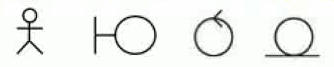
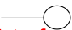
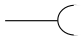
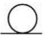
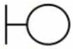
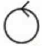

\#includes: L3, L4, L5, L6, L9andL10

# UML
> UML is beautiful, it allows the usage of the same notation for all the steps of the design

## usage of models
- models are used in 3 types of activities
  - **communication**: an abstraction, that enables people to discuss a system, even if it has not been built yet
    - informal drawing
  - **analysis and design**: an abstraction, that allows to reason about a system.
    - Expressed in UML
  - **Archive**: compact representation for storing a design for future systems

### general notation
- `[x1][:t1]` where
  - `x1` is of the type
  - `t1`
    - eg: `maxNumTest:int` method, that returns an int
      - `e:String` *e* is a variable of type *String*
- in eg. class diagrams, conditions like `a!=null` are notated as a ***note*** on the class (eg. `<<postcondition >> a!= null` for OCL contracts)

### The Class Diagram
- class diagrams represent the **structure of the system**
- **notation**:
  - classes are shown as rectangles
    - italic -> *abstract class*
  - associations are shown as lines
    | [classname]  |
    |--------------|
    | [attributes] |
    | [methods()]  |
  - attributes in the second field from top
  - methods in third field from top
  - **inheritance**: triangle, ([target]<---"is one of"---[origin])
  - **aggregation**: diamond, "consists of"-hierarchy ([aggregate]<>---"consists of"--num-[component])
    - **composition**: solid black diamond, "cannot exist without" (bidirectional)
  - **attributes and methods:**
    - `+` public
    - `-` private
    - `#` package (**not** Javas package logic!)
- multiplicities are notated on the specific side of the association, default is 1
- 3 Types of objects:
  - **entity objects**
    - neither of the ones below
  - **control objects**
    - "allows to control the entity objects"
  - **boundary objects**
    - "user interface"
- ***qualified association***: used to select an object (or objects) from a larger set of related objects, based upon the qualifier key. Informally, in a software perspective, it suggests looking things up by a key, such as objects in a HashMap.
  - also see [chapter: UML->Associations]

### instance diagram
- instances declares in rectangles (see class diagram)
  - `[instance:][class]` 
    where:
    - `[instance]` is optional and declares an instance of `[class]`
    - `[class]` is the actual class
  - names are underlined to notate an actual instance
  - instances are *linked* with each other (*X-to-X* association)

### Sequence Diagrams
- used during analysis
  - to find "particitpating objects"
  - to indentify operations on these
- used during system design
  - to refine subsystem interfaces
- useful to identify missing objects
- complement class diagrams
- **notation**
  - *instances*: rectangles (contains type of instance, optional: containing name of instance)
  - *actors*: sticky figures
  - *lifeline*: dashed lines
    - *deallocation*: cross at end of lifeline
  - *messages*: arrows (Operations on a participating object, for example method calls)
    - *iteration*: star before message name
    - *predicate*: square brackets before message name
  - *data flow*: dashed arrow (for example return values)
  - *activations*: narrow rectangles (activation record metaphor)
  - *optional steps*: box containing optional steps that says "opt [condition]" in upper left corner
  - *alternative steps*: box containing optional steps that says "alt [condition]" in upper left corner

### communication diagrams
  - Shows the interaction between objects or parts in terms of sequenced messages
  - Communication diagrams represent a combination of information taken from Class, Sequence, and Use Case Diagrams describing both the static structure and dynamic behavior of a system.
  - However, communication diagrams use the free-form arrangement of objects and links as used in Object diagrams.
  - The communication diagram illustrates the flow of messages between the objects using the layout of the class diagram
  - The sequence diagram uses lifelines, it does not use the layout of the class diagram.
  - Communication diagrams show which elements each one interacts with better, but sequence diagrams show the order in which the interactions take place more clearly.

  

### statechart diagrams
- *state*: an abstraction of the attributes of a class
- states have duration

- **notation**
  - *transition*: arrow
    - ---Event(attribute) [condition]/activity--->   (all parts are optional)
  - *state*: rounded rectangle, name in top, line below, activities below line
  - *activity* (behavior):
    - prefixed with "/"
    - in state:
      - *entry/<activity>* executed on entry of state
      - *do/<activity>* executed while in state (loop)
      - *exit/<activity>* executed when leaving state
  - *control node*
    - *initial state*: solid circle
    - *final node*: solid circle surrounded by a circle
    - *fork node*
    - *join node*
    - *choice node*: diamond, condition in diamond
      - conditions noted on outgoing arrows (guard predicate)
    - *self transition*: transition, where target is identical with origin state

#### state chart diagrams vs. sequence diagrams
- statechart diagrams help to identify:
  - changes to an individual object over time
- sequence diagrams help to identify
  - the temporal relationship of between objects over time
  - sequence of operations as a response to one or more events

### activity diagrams
- activity diagrams consist of nodes and edges
- a **node** describes an activity or object
  - object node
  - executable node
  - control node
- an **edge** is a directed connection between nodes
  - control flow edges
  - object flow edges
- **notation**
  - *object node*: square containing *object name*
  - *executable node*: rounded square containing *action name*
  - *pin*: alternative notation for an object node
    - small square on both ends (exec nodes) of the edge
  - for *initial state, final state, fork- / join node, choice node* see statechart diagram
  - *choice nodes* also called *decision / merge nodes*
  - *fork / join nodes*
    - fork == "splitting"
    - join == "synchronisation"
    - **multiple activities between fork and join are executed in parallel**
  - *swim lanes*: rectangle containing all the activities associated with one actor

### Sequence diagrams
- Sequence diagrams are distinguished into two structures
  - *Fork diagrams*
    - The dynamic behavior is placed in a single object, usually a control object
      - it knows all the other objects and talks to them directly
  - *stair diagrams*
    - The dynamic behavior is distributed. Each object delegates responsibility to other objects
      - each object only knows a few of the other objects and knows, which objects can help with a specific behavior
  - stair vs. fork
    - stair: decentralized control structure
      - the operations have a strong connection
      - the operations are always performed in the same order
    - fork: centralized control structure
      - the operations can change order
      - new operations are expected to be added

  - heuristics for sequence diagrams
    - column layout - from left to right
      - 1st column: *actor* of the use case
      - next columns: *boundary objects*
      - next columns: *control objects*, that manage the rest ob the use case
      - remaining columns: *entity objects*

      
    - order in the creation of objects
      - create control objects at the beginning of the flow of events
      - the control objects then create the boundary objects
    - access of objects
      - control / boundary objects can access entity objects
      - entity objects should not access boundary objects

### component diagram
- used to model the top-level view of the system design in terms of components and dependencies among the components
- The *dependencies* (edges in the graph) are the connectors are shown as dashed lines with arrows from the client component to the supplier component
  - The types of dependencies are implementation language specific
- there are two types of interfaces:
  - a *provided interface* is modeled using the lollipop notation   
  - a *required interface* is modeled using the socket notation   
- a *port* specifies a distinct interaction between the component and the environment
  - ports are depicted as small squared in the sides of classifiers

### deployment diagram
- Deployment diagrams are useful for showing a design after these system design decisions have been made
  - Subsystem decomposition
  - Concurrency
  - Hardware/Software Mapping
- a deployment diagram is a graph of nodes and connections
  - *nodes*: 3-D boxes
  - *connections*: solid lines between nodes
  - nodes may contain *components*
    - Components can be connected by “lollipops” and “sockets”
    - Components may contain objects (indicating that the object is part of the component)

## Abstract UML

### Stereotypes
- stereotypes allow to extend the vocabulary of the UML so new model elements can be created and derived from existing ones
- stereotypes are for example: << boundary>> << control>> << entity>> << constructor>> << getter>> << setter>> << interface>> << extend>> << include>>
### 3 different types of objects
1) **entity objects**
  - Represent the persistent information tracked by the system (*application domain* objects)
  - notation: 
2) **boundary objects**
  - represents the interaction between the user and the system
  - notation: 
3) **control objects**
  - represent the control tasks to be performed by the system
  - notation: 

### actor vs. class vs. object
- **actor**
  - any object outside the system, interacting with the system
- **class**
  - an abstraction modeling an entity in the application domain or in the solution domain
  - classes are part of the system
- **object**
  - an instance of a class

### Associations
- the multiplicity of associations denotes how many objects the instance of a class can reference
- types:
  - one to one association
  - one to many association
  - many to many association
- multiplicity 1 is default
- *qualifiers*
  - small rectangle containing the qualifier
  - used to reduce the multiplicity of an association
  - without / with qualification:
    

### Creating UML from written language
| Grammatical construct | UML model component | example|
|---|---|---|
|Proper noun|object|monopoly|
|improper noun|class|toy|
|doing verb|operation|buy, recommend|
|being verb|inheritance|is an|
|having verb|aggregation|has an|
|modal verb|constraint|must be|
|adjective|attribute|dangerous|
|transitive verb|operation|enter|
|intransitive verb|constraint, class, association|depends on|

- other knowledge sources:
  - application domain knowledge 
    end users and experts know the abstractions of the application domain
  - solution domain knowledge 
    abstractions in the solution domain
  - general world knowledge 
    your generic knowledge and intuition
