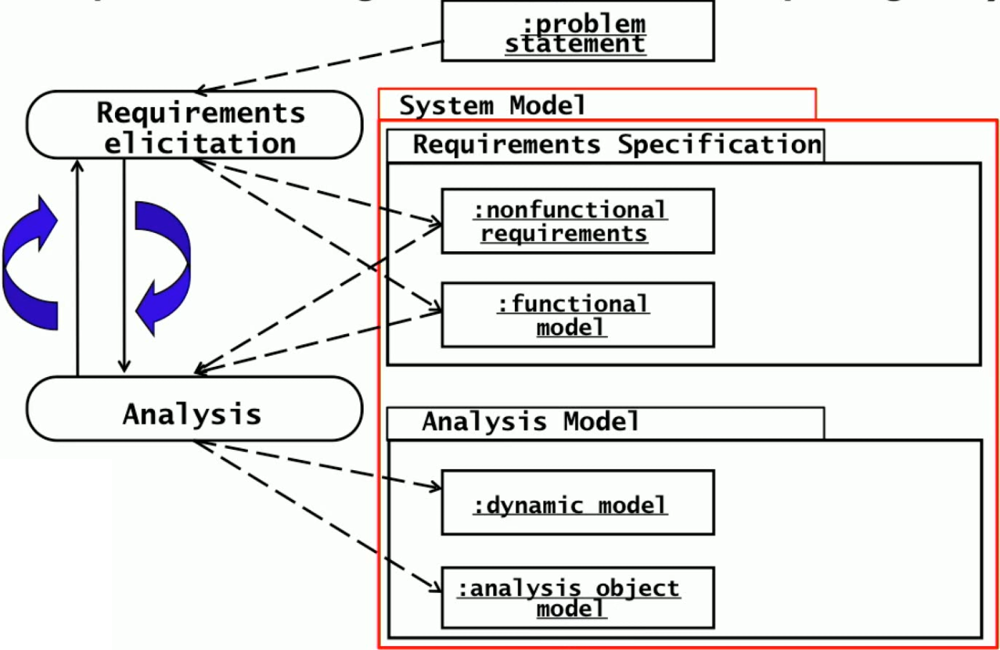
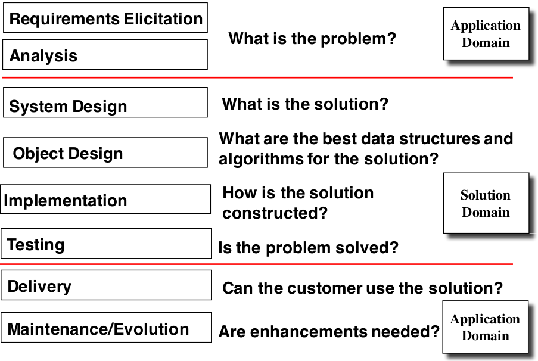
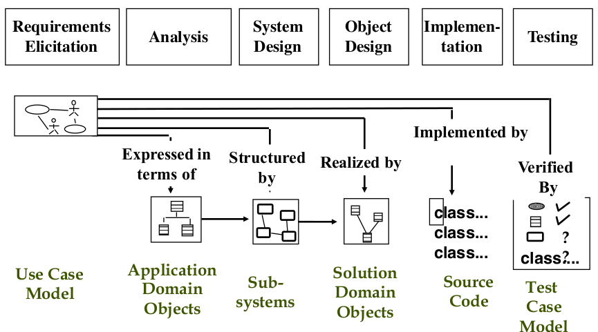
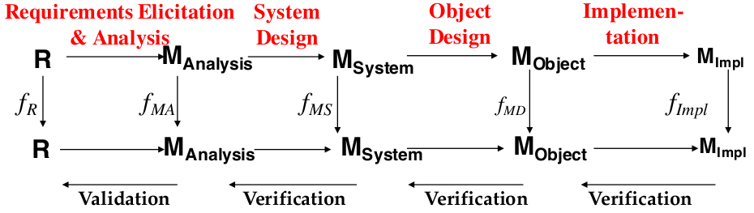

\# includes L7

## Requirements Elicitation
- Determining the requirements of the system specified by the customer and/or the user
> From the problem statement to the requirement specification

### Requirements
- A **Requirement is a feature that the system must have or a constraint is must satisfy to be accepted by the client**
  - requirements describe the user's view of the system
  - identify the *what* of the system, not the *how*

  |Part of requirements|not part of req.|
  |---|---|
  |functionality|system design|
  |user interaction|implementation technology|
  |error handling|development methodology|
  |environmental costs (interfaces)|   |

### Requirement Engineering

- **Requirement elicitation**
  - definition of the system in terms understood by a customer or user
  - Result: **requirement specification**
    - uses natural language
- **analysis (model)**
  - definition of the system in terms understood by a developer
  - Result: **Analysis model** aka **technical specification**
    - uses a (semi-)formal language (e.g. UML)
- **requirement engineering**
  - combination of the two activities
  - "an activity that defines requirements of the system under construction"
- As a UML model:
  

#### Typical Software Development Activities
Top to bottom

Acitivities and their models:

### Difficulties at requirement elicitation
1) how can the *purpose* of the system be identified
  - what are the requirements and constraints?
2) how can the system boundary be identified
  - what is *inside* and *outside* of the system?

### Types of requirements elicitation
- Greenfield Engineering
  - Development from scratch, no prior system exist
  - requirements are extracted from the client and user
  - triggered by user needs
- re-engineering
  - re-design or re-implementation of an existing system
  - requirements triggered by new technology
- interface engineering
  - provide services of an existing system in new environment
  - requirements triggered by technology or new market needs
- each of these requirements elicitation types should start with the problem statement

### Problem statement
- a description of the problem addressed by the system
- synonym: statement of work
- a problem statement describes:
  - the current situation
    - describes the problem to be solved
    - describes the motivation (change in application or solution domain)
    - describes new desired functionality
    - describes the change in the  solution domain
  - the functionality the new system should support
  - the environment in which the system will be deployed
  - deliverables expected by the client
  - delivery dates
  - a set of acceptance criteria (criteria for system tests)

### Types of requirements
- **Functional requirements** (-> use case model)
  - **functionality**
    - what is the software supposed to do
  - **external interface** (-> actors)
    - interaction with people, hardware, other software
- **nonfunctional requirements**
  - performance requirements (speed, availability,...)
     - describe performance restrictions on the system
  - quality requirements ("URPS")
    - describe probperties of the system of domain
    - quality requirements are:
      - **U**sability
        - the ease with which actors can perform a system function
      - **R**eliability
        - robustness
          - the ability of a system to maintain a function when
            - the user enters a wrong input
            - there are changes in the environment
        - safety
      - **P**erformance
        - response time, throughput,
        - availability
          - the ration of the expected uptime of a system to the sum of the expected up and downtime
        - accuracy
      - **S**upportability
        - adaptability
          - the ability of a system to adapt itself to changed circumstances
        - maintainability
          - the ease with which a system can be modified by a developer to correct defects, deal with new requirements or cope with a changed environment
        - portability
      - **safety**
        - protection against unwanted incidents
      - **security**
        - protection against intended incidents
  - constraints (*pseudo requirements*) (required standards, operating environment, ...)
    - imposed by the customer or the environment
    - constraints are:
      - Compliance to standards
      - implementation requirements (programming languages, tools, ...)
      - operation requirements (administration and managements of the system)
      - legal requirements (licensing regulation, certification)
      - packaging requirements (constraints on the actual delivery of the system)
      - interface requirements (constraints imposed by external systems)
      - legal requirements

#### Techniques to describe requirements
- goal: bridging the gap between end users and developers
- Techniques:
  - **scenario**
    - describes the use of the system as a series of interactions between a specific end user and the system
    - **use case**
      - a concept that describes a set of scenarios of a generic end user, called actor, interacting with the system
        - a scenario describes a single instance of a use case
    - **user story**
      - describes a functional requirement from the perspective of an end user
- **scenario**
  - a concrete, focused, informal description of a single feature of the system used by a single actor
  - the basis is the textual description of the usage of a system, written from the end user's point of view
  - **scenario based design**
    - scenarios are used as the bases for the design of the hypothetical interaction of the end user with a new system
  - scenarios are used in many activities during the software lifecycle
    - *requirements elicitation*: as-is scenario, visionary scenario
    - *client acceptance test*: evaluation scenario
    - *system deployment*: training scenario
  - **types of scenarios**
    - **as-is scenario**
      - describes a current situation. the scenario describes the usage of an existing system
      - commonly used in re-engineering projects
    - **visionary scenario**
      - describes a future system
      - used in all types of projects
    - **evaluation scenario**
      - description of a user task against which the system is to be evaluated
    - **training scenario**
      - a description of the step by step instructions that guide a novice user through a system
  - **how to find scenarios**
    - don't expect the client to be verbose if the system doesn't exist
      - clients understand the application domain, not the solution domain
    - engage a dialectic approach
      - talk to the client
      - he helps you to understand the requirements
      - the requirements often evolve while these scenarios are being formulated
      - usually the problem statement is a good start
    - **heuristics** for finding scenarios
      - ask yourself or the client the following questions:
        - what are the primary tasks that the system needs to perform?
        - what data will the actor create, store, change, remove, or add in the system?
        - what external changes does the system need to know about?
        - what changes or events will the actor of the system need to be informed about?
      - insist on *task observation* if the system already exists
        - ask to speak to the end user, not just the client
 - **after the scenario is formulated**
  - find functions in the scenario where an actor interacts with the system
  - describe each of these use cases in more detail
    - participating actors
    - describe
      - entry condition
      - the flow of events
      - exit condition
      - exceptions
      - constraints

## Requirements review
- after we are done with the requirements elicitation and with analysis, the next step is a requirements analysis document
  - we can validate the requirements with the user and the client
### Requirements Validation: 6 criteria
1) correctness
  - the requirements represent the client's view
    - the model should not contain unintended features
    - difference between verification and validation
2) clarity
  - the requirement can only be interpreted in one way
3) completeness
  - all possible ways of using a system are described
  - no classes or associations are missing
4) consistency
  - there are no requirements that contradict each other
  - dynamic, functional and object model use consistent naming
5) realism
  - the requirements can be implemented and delivered
6) traceability
  - each system component and behavior can be traced to a set of functional requirements
    - not covered in EIST!

### Verification of models vs. validation of models
- *verification* is an equivalence check between two models, one of them generated from the other one
- *validation* is the comparison of the model with the reality

  
### what should not be in the requirements:
- a description of the system structure
- the development methodology
- a description of the development environment
- a specific implementation language
- reusability
- -> is is desirable that none of the above is constrained by the client
