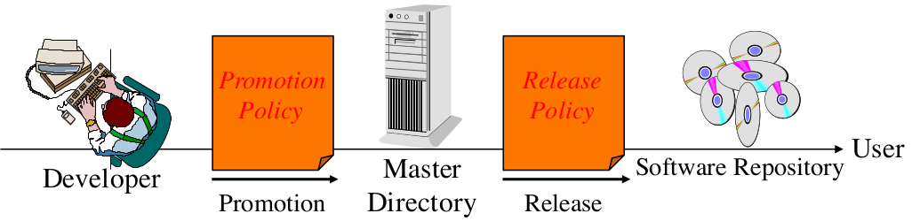

# Software Configuration Management
- Software Configuration Management is a **project function** with the **goal to make technical and managerial activities more effective**
- **Multiple Persons** have to work on software that is changing
- **more than one version** of the software has to be supported
- manages **evolving software systems**
- an activity that **allows to deal with different changes in different situations**

- Software Configuration Management can be **administered in several ways**:
  - Organization-wide
  - Project-specific
  - Distributed among the project members
  - Mixture of all of the above.

- a **set of management disciplines and techniques of initiating, evaluating and controlling change of a software project**

- **roles**:
 - **configuration manager**
 - **change control board member**
 - **developer**
 - **auditor**

### **SCM activities:**
- **configuration item identification**
  - modeling the system as a set of evolving components
- **change management**
  - management of change request
- **promotion management**
  - creation of versions for other devs
- **branch management**
  - management of concurrent development
- **release management**
  - creation of versions for clients and end users
- **variant management**
  - management of coexisting versions

## Configuration Item Identification
- ***Configuration Item***:
  - An aggregation of hard- / software (or both)
- Software configuration items are not only source files
- Selecting the right conf is a skill (similar to obj modeling)
  - find conf items
  - find relations between these
- **baseline**: A specification or product that has been reviewed, serves the basis for the further development
- **Change management**: handling of change requests
  - process:
    - the change is requested
    - the request is assessed
    - rejected or accepted
    - if accepted assigned to a dev
    - the implement is audited
- **change policy**: guarantee tat each promotion or release conforms to commonly accepted criteria
  - for example: "promotion policy", "release policy"
- **IEEE 828**
  - divides in
    - Programmers Directory
    - Master directory
    - Software directory
- **git terminology**
  - feature branch
  - development branch
  - master branch

## Controlling changes
- two types of controlling change:
  - ***promotion***: the internal development state of a software is changes
  - ***release***: a changes software system is made visible outside the development organization 

- Approaches for controlling change:
  - informal (promotion, research type environments)
  - formal (releases, externally developed CIs)

## Baselines
- types of baselines:
  - ***product baseline***
  - ***developmental baseline***
  - ***functional baseline***

## Branch management
- use branches to control concurrent development and explorations
- map functional requirements to feature branches
- important: minimize branch lifetime

## requirements for release management
- large and distributed software projects need to provide a development infrastructure with an integrated ***build management***
  - regular builds from the master directory
  - automated execution of  tests
  - notifications
  - determination of code metrics
  - automated publishing
- the transition **from source code to the executable application** consists of a sequence
  1) Setting the required paths and libraries
  2) compiling source code
  3) copying source files
  4) setting file permissions
  5) packaging the applications
- performing these activities is time consuming and commonly produces errors

## Prototyping
- ***Revolutionary Prototyping*** (aka rapid prototyping)
  - Also called specification prototyping
  - Get user experience with a throwaway version to get the requirements right, then build the whole system
  - Advantage: Can be developed in a short amount of time
  - Disadvantage: Users may have to accept that features in the prototype are expensive to implement
- ***Evolutionary Prototyping***
  - The prototype is used as the basis for the implementation of the final system
  - Advantage: Short time to market
  - Disadvantage: Can be used only if target system can be constructed in prototyping language
