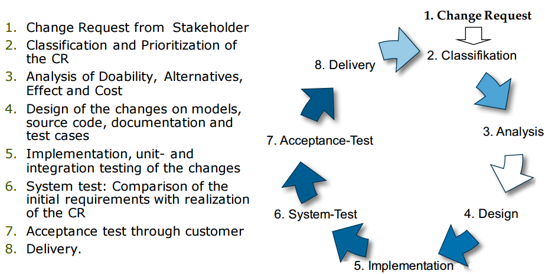
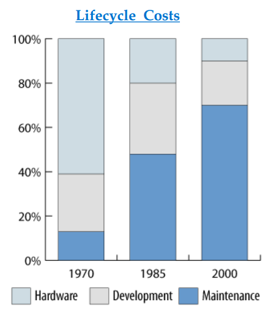
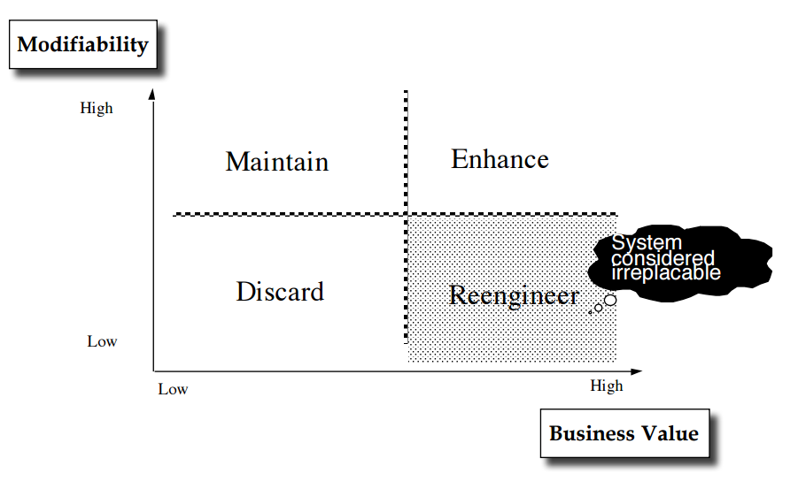
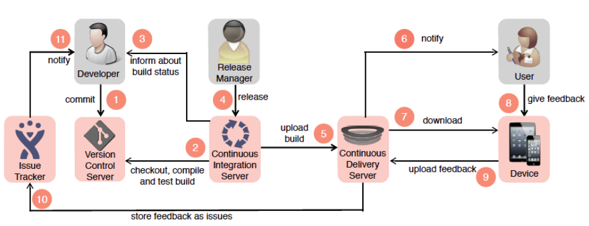
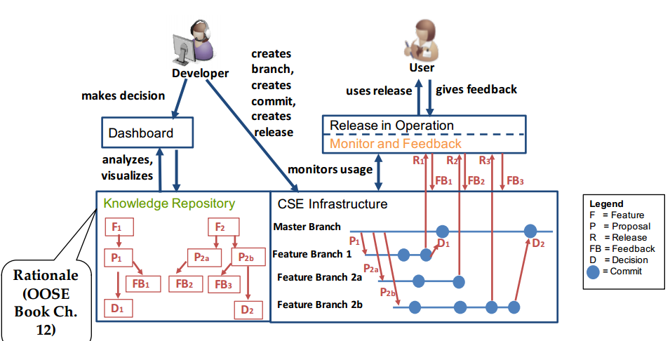

\includes L20

## Software Maintenance
- Hardware maintenance
  - a malfunctioning system or a component is returned to its original state
- software maintenance
  - dealing with failures after delivery

- Types of Maintenance
  - ***corrective maintenance***
    - reactive modeification of a software product performed after delivery to correct discovered problems
  - ***perfective maintenance***
    - modification of a software product after delivery to improve performance or maintainability
  - ***adaptive maintenance***
    - modification of a software product performed after delivery to keep a software product usable in a changed or changing environment
  - ***preventive maintenance***
    - modification of a software product after delivery to detect and correct errors  ("latent faults") in the software product before they become effective faults

## Evolution
- creating a new design from existing ones
- includes remodeling, refactoring with the goal to add, improve or support
  - new functional requirements
  - new nonfunctional requirements
- dangers:
  - software bloat
  - increasing complexity

- software bloat
  - the phenomenon where successive versions of software become perceptibly slower, unse more resources or have higher requirements then previous versions
  - reasons:
    - user perceptible improvements
    - competing standards
    - similar products after a merge create demand for integrations
    - feature creep: the software has to deal with a large market
- software entropy
  - as a software system is modified, its disorder, or entropy, can only increase (following the second law of thermodynamics)

### maintenance vs. evolution
- software maintenance
  - preventing software from failing to deliver the intended functionalities by means of bug fixing
- software evolution
  - continual change to a better state

#### Lehmans law of software evolution
  1. Continuing Change:
    - Unless a system is continually modified to satisfy emerging needs of users, the system becomes increasingly less useful
  2. Increasing Complexity:
    - Unless additional work is done to explicitly reduce the complexity of a system, the system will become increasingly more complex due to maintenance-related changes
    - Ivar Jacobsen used the term “Software Entropy”
  3. Self Regulation:
    - The evolution process is self-regulating in the sense that the measures of products and processes, that are produced during the evolution, follow close to normal distributions.
  4. Conservation of Organizational Stability:
    - The average effective global activity rate on an evolving system is almost constant throughout the lifetime of the system. In other words, the average amount of additional effort needed to produce a new release is almost the same
  5. Conservation of Familiarity
    - Stakeholders (developers, users,...) must gain a desired level of understanding of the system’s content and behavior to realize satisfactory evolution
    - Large incremental growth in a release reduces that understanding. Therefore, the average incremental growth in an evolving system remains almost the same
  6. Continuing Growth
    - The functionality of a system must be continually increased to maintain user satisfaction over the system lifetime
  7. Declining Quality
    - Unless the design of a system is fine-tuned and adapted to new operational environments, the system will be perceived as declining over the lifetime of the system
  8. Feedback System:
    - The system’s evolution process involves multi-loop, multi- agent, multi-level feedback among different kinds of activities
    - Developers must recognize those complex interactions in order to continually evolve an existing system to deliver more functionalities and higher levels of qualities.
- Limits: 3,4,5 are not valid for free / open software

### staged model of maintenance and software evolution
- has 4 stages
  - initial development, evolution, servicing, phaseout
1. **initial development stage**
  - When the initial version of the system is produced, detailed knowledge about the system is fresh.
  - Before the delivery of the system, it undergoes many changes. Eventually, a system architecture emerges and stabilizes
2. **evolution stage**
  - It is easy to perform simple changes to the system. In the period immediately following the delivery, knowledge about the system is still almost fresh in the minds of the developers.
  - It is possible that the development team as a whole no longer exist, because many original developers have taken up new responsibilities or have left.
3. **servicing stage**
  - the knowledge of the system has been significantly decreased
  - developers focus on maintenance tasks
4. **phaseout stage**
  - a system is replaced for various reasons
    - too expensive to maintain
    - there is a newer solution available
  - the organization must develop an exit strategy to move to the new system

### change management
- changes are always triggered by chance requests
- Maintenance in large systems is triggered by change requests in delivered systems
- Evolution in large systems is triggered by change requests in baselines

### Process Model for maintenance (IEEE 1219) 

### Lifecycle Costs of Maintenance
- 1990: 120 billion lines maintained worldwide
- 2000: 250 billion lines 

### Maintenance vs reengineering 

### ***Legacy system***
- a system that has evolved over the last 10-30 years
- still actively used in a production environment
- considered irreplaceable
- extremely high maintenance costs
- Designed without modern software design methodologies or design has been "lost“
- Change is required due to new functional, nonfunctional or pseudo requirements

### Maintainability
- quality of the system has a high impact on the maintainability
  - Analysability — the system is easy to analysis and to understand
  - Changeability — the system is easy to change
  - Stability — Changes to the system do not lead to unexpected behaviors
  - Testability — the system is easy to test
  - Standards — the system is compatible with existing standards

### Maintenance as a workflow
- in recent software lifecycle progresses maintenance is modeled as a project function

## Continuous Software engineering
- the organizational capacity to develop, release and learn from software in very short rapid cycles
- the technology used in the different development phases (requirements engineering,, system integration) must support the quick development cycles
- **continuous integration**
  - the goal is to have a working version of the software all the time during the project
  - The development team uses an automated workflow to periodically integrate and test all parts of the system to validate the correct functionality of a system after making changes
  - When a test does not pass, the team immediately turns their attention to finding and fixing the faults. This reduces integration problems, and ultimately speeds up development.

- **continuous deployment**
  - The practice of continuously deploying successful software builds automatically to some environment, but not necessarily to actual users. The practice of continuously deploying successful builds automatically

- **continuous delivery**
  - Continuous delivery implies continuous deployment and is the practice of ensuring that the software is continuously ready for release and deployed to actual customers
   
  

- ***DevOps***
  - A set of practices that advocate the collaboration  between development and operations (“The IT guys”) with the goal to shorten the feedback loop and align the goals of both.

### Adding knowledge to CSE 

###***Model-driven Software Development***
- Some acronyms for model-driven software development
  - ***MDE (Model-Driven Engineering)***
    - A development methodology which focuses on creating and exploiting domain models (application domain models, solution domain models)
    - Usually used when the development consists of hardware and software components
  - ***MDD (Model-Driven Development)***
    - It is impossible to keep a model consistent automatically after a manual change of the generated code
    - Manual changes to generated code should be avoided
    - MDD is forbids round-trip engineering
  - ***MDA (Model-Driven Architecture)***
    - The system functionality is defined using a platformindependent model (PIM) and an appropriate domainspecific language (DSL)
    - The MDA acronym is used mainly by the Object Management Group (OMG).

## Methodologies
- Software methodologies provide
  - Guidance and general principles for dealing with complexity, change and uncertainty
  - Strategies for selecting methods and tools in a given project environment
  - Guidance what to do when things go wrong
- Key questions in a methodology
  - How much involvement of the customer?
  - How much planning?
  - How much reuse?
  - How much modeling?
  - How much process?
  - How much control and monitoring?
