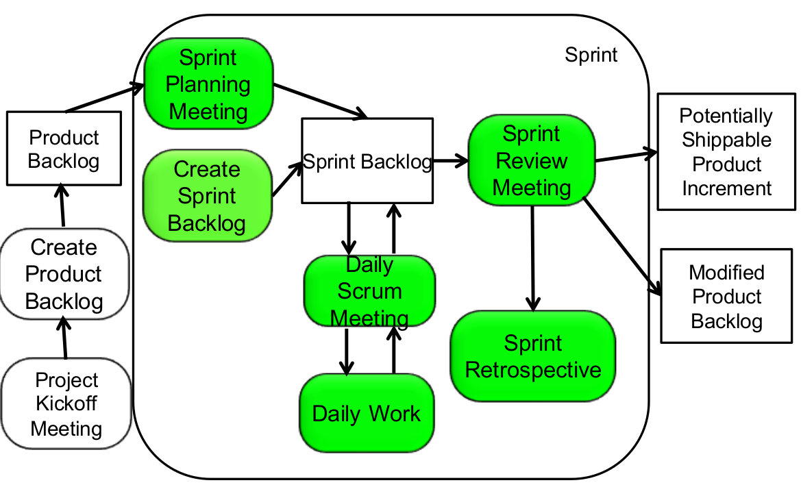

# Agile Processes and Methodologies

## Outline
- Key decisions
- project context
- Methodology spectrum
- Different types of planning
 - panning, design reuse, modeling, process, control&monitoring, redefinition
- different ways to use models
- use of processes in software development

### Key decisions
- project goals (scope)
- schedule (time)
- cost (effort)
- project environment
- software life cycle model (quality)
- tools
- methods
- team members and organization (effort)

Influenced by methodology

## Methodology
- Collecting methods and tools for developing and managing a software system
- Project environment
  - defined by the client and the current state of the development
- methods
  - techniques to choose from
- tools

###A methodology specifies for a specific environment
- when methods or tools should be used or not
  - what to do when unexpected events occur

###Noise in communication
- when projects become more complex, many choices have to be made
  - unexpected events occur
  - even more decisions have to be made

###Methodology issuses
- Key questions for which methodologies provide guidance
  - How much involvement of the customer
  - how much planning
  - how much reuse
  - how much modeling before coding
  - how much process
  - how much control and monitoring?

###Controlling Software Dev with a process (two ideas)
- through organisational maturity
  - repeatable processes
- or through agility
  - large parts of SD is empirical

##***Defined process control***
- tasks and activities are defined
- defined inputs and same outputs every time
- preconditions
  - requires that every piece of the project is understood before beginning
- **Defined processes do not deal well with interferences**

##***Empirical process***
  - an imperfectly defined process, not all pieces are completely understood
  - given a well-defined set of inputs, different outputs may be generated
  - "the empirical process expects the unexpected"
  - conditions when to ally this model:
    - change is common

## ***Scrum***
- scrum is a technique to manage and control software and product development when the requirements are clear
- work is performed in parallel
- **methodology:**
  - involvement of the customer
    - onsite customer
  - planning (project backlog)
    - checklists and incremental daily plans
  - reuse
    - checklists from previous projects
  - modeling
    - models may or may not be used
  - process
    - iterative, incremental adaptive process
  - control and monitoring
    - daily meetings
      - short meeting
      - participants: scrum master and scrum team
      - questions for each team member:
        - status
        - issues
        - action items
- Project backlog
  - concerns project
- Sprint backlog
  - list of open issues
  - concerns the team

