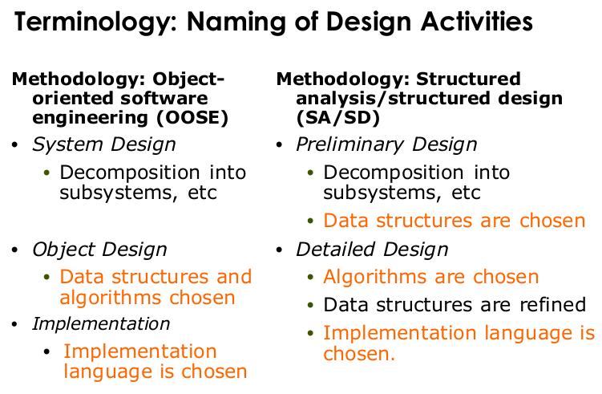

\# includes L10

## Object design
- modeling must adress our mental limitations
  - good models deal with this limitation, because
    - they do not tax the mind
    - they reduce complexity
    - they use abstractions
    - they provide *modifiable designs*: abstract classes, inheritance, delegation
    - design patterns are examples of *software engineering knowledge*
### Purpose of object design
  - prepare the implementation of the system model based on design decisions
  - transform the system model (optimize it)
- investigate alternative ways to implement the system model
  - use design goals (eg. minimize exec time, momory, ...)
- Object design serves as the basis of implementation

  
  
  

### object design consists of 4 activities
1) reuse: identification of existing solutions
  - use of inheritance
  - off the shelf components
  - use of design patterns
2) interface specification
  - describes precisely each class interface
3) object model reconstructing
  - transforms the object design model to improve its understandability and extensibility
4) object model optimization
  - transforms the object design model to address performance criteria, such as response time or memory utilization

### identifying components
1) identify the missing components in the design gap
2) "make a build"- or "buy"-decision to obtain the missing component 
=> *component based software engineering*:
    - the design gap is filled with available components (0% coding)
- Special Case: COTS-Development
  - COTS: Commercial-off-the-Shelf
  - The design gap is filled with commercial-off-the-shelf-components 
  => Design with standard components

### types of reuses
- Reuse of Source Code
- Reuse of Interfaces
- Reuse of existing Classes
#### reuse in object design
  - problem: closing the design gap
  - goals:
    - Reuse of existing classes
    - Reuse of existing interfaces
    - Reuse of design knowledge (from previous experience)
  1) ***Composition*** (black box reuse)
  - A new class is created by the aggregation of the existing classes. The new class offers the aggregated functionality of the existing classes
  - typical situations for black box reuse
      - the implementation of a specific algorithm may necessitate new objects to hold values
      - new low- level operations may be needed during the decomposition of high-level operations
  2) ***inheritance*** (white box reuse)
  - A new class is created by subclassing. The new class reuses the functionality of the superclass and may offer new functionality
  - the use of inheritance
    - inheritance is used to achieve two different goals
      - *Description of Taxonomies*
        - used during *requirement analysis*
        - Activity: Identify application domain objects that are hierarchically related
        - Goal: Make the analysis object model more understandable
      - *interface specification*
        - Used during *object design*
        - Activity: Identify the signatures of all identified objects
        - Goal: Increase the reusability, enhance the modifiability and the extensibility
  - *inheritance* is used during analysis as well as object design

### Implementation Inheritance
##### Discovering inheritance associations
- To “discover“ inheritance associations, we can proceed in two ways, which we call specialization and generalization
- Generalization: the discovery of an inheritance relationship between two classes, where the sub class is discovered first.
  - first the subclasses are found, then the super class
    - Remodeling: Restructuring at the UML model level
    - Refactoring: Restructuring at the source code level
- Specialization: the discovery of an inheritance relationship between two classes, where the super class is discovered first.
  - Specialization occurs, when we find a subclass that is very similar to an existing class

#### Meta-model for inheritance

#### Definitions
- ***Implementation Inheritance***
  - Subclassing from an implementation
  - Reuse: Implemented functionality in the super class
- ***Delegation***
  - Catching an operation and sending it to another object where it is already implemented
  - Reuse: Implemented functionality in an existing object
- ***Specification Inheritance***
  - Subclassing from a specification
  - The specification is an abstract class where all the operations are specified but not yet implemented
  - Reuse: Specified functionality in the super class.

### Delegation
- delegation is a way of making composition as powerful for reuse as inheritance
- In delegation, three objects are involved:
  - The Client calling the Receiver
  - The Receiver sending the request to the Delegate
-   The Delegate executing the request
- The existence of the Receiver makes sure, that the Client cannot misuse the Delegate object.

### Delegation vs Implementation Inheritance
- *Inheritance*: Extending a Base class by a new operation or overriding an existing operation
  - pro: Flexible, because any object can be replaced at run time by another one (as long as it has the same type)
  - con: Inefficient, because objects are encapsulated
- *Delegation*: Catching an operation and sending it to another object
  - pro
    - Straightforward to use
    - Supported by many programming languages
    - Easy to implement new functionality in the subclass
    - Inheritance exposes a subclass to the details of its parent class
  - con:
    - Any change in the parent class implementation force the subclass to change (which requires recompilation).

### specification inheritance
- eg: implementation of interfaces / abstract classes

#### Abstract Operations in Java: Method Overriding and Strict Inheritance
- *Method overriding*
  - A programming language construct that allows an implementation in the subclass to override (replace) the implementation in the superclass by providing a method with the same signature as the method in the parent class
  - Java methods can be overridden by default, i.e. there is no special keyword
- *Strict inheritance*
  - The subclass can only add new methods to the superclass, it cannot override them
  - If a method cannot be overridden in a Java program, it must be prefixed with the keyword final.

#### contraction
- Contraction: A mechanism where implementations of methods in the super class are overridden with empty bodies in the subclass to make the super class operations “invisible“
- Contraction is a special type of inheritance
- Used often for “quick and dirty” reuse
- Should be avoided at all cost
