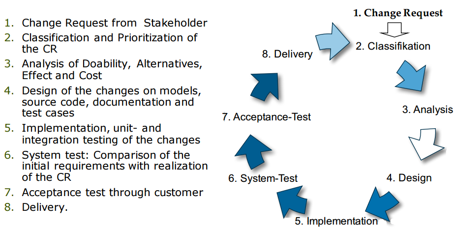
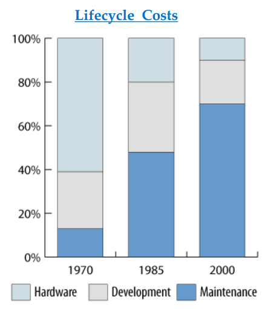
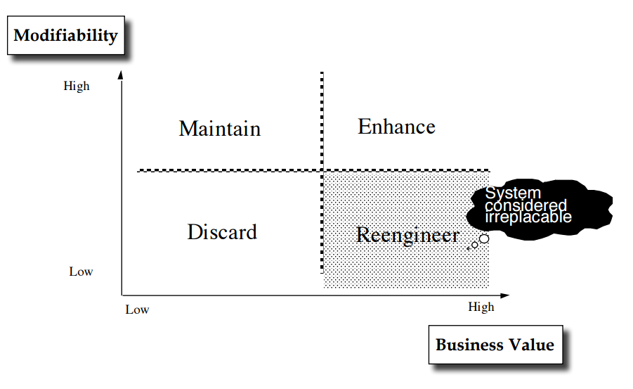
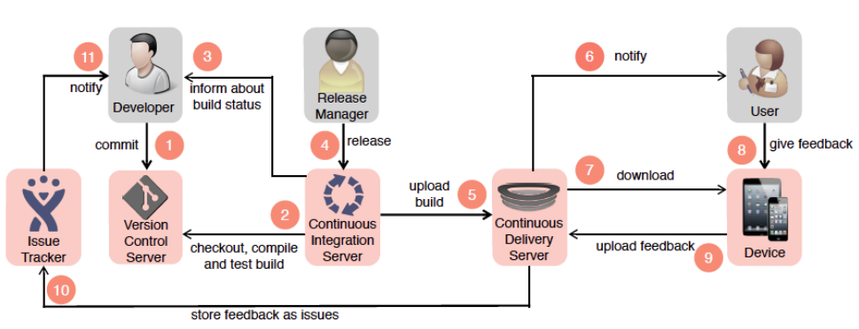
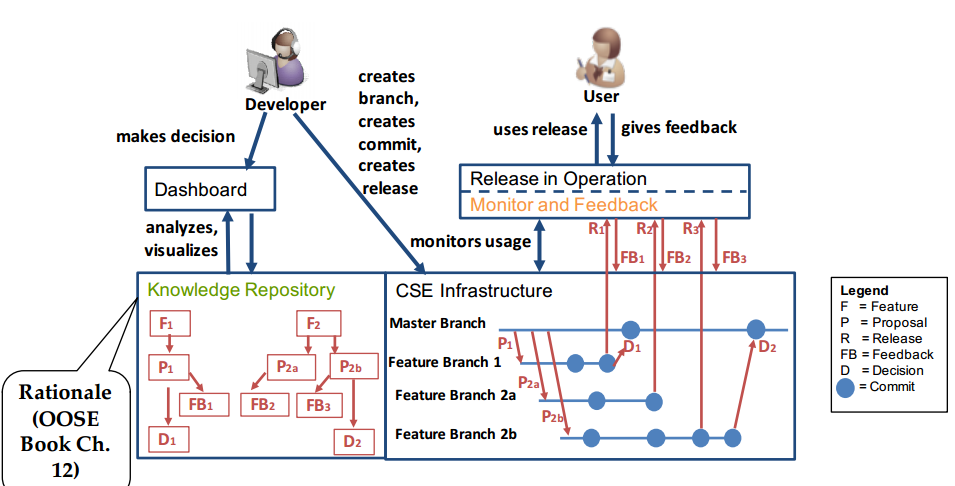

\includes L20

# Software Maintenance
- Hardware maintenance
  - a malfunctioning system or a component is returned to its original state
- software maintenance
  - dealing with failures after delivery

- Types of Maintenance
  - corrective maintenance
  - perfective maintenance
  - adaptive maintenance
  - preventive maintenance

## Evolution
- creating a new design from existing ones
- includes remodeling, refactoring with the goal to add, improve or support
  - new functional requirements
  - new nonfunctional requirements
- dangers:
  - software bloat
  - increasing complexity

- software bloat
  - the phenomenon where successive versions of software become perceptibly slower, unse more resources or have higher requirements then previous versions
  - reasons:
    - user perceptible improvements
    - competing standards
    - similar products after a merge create demand for integrations
    - feature creep: the software has to deal with a large market
- software entropy
  - as a software system is modified, its disorder, or entropy, can only increase (following the second law of thermodynamics)

### maintenance vs. evolution
- software maintenance
  - preventing software from failing to deliver the intended functionalities by means of bug fixing
- software evolution
  - continual change to a better state

**TODO: Lehmans laws of software evolution, slide 18**

### staged model of maintenance and software evolution
- has 4 stages
  - initial development, evolution, servicing, phaseout
- initial development stage
  - When the initial version of the system is produced, detailed knowledge about the system is fresh.
  - Before the delivery of the system, it undergoes many changes. Eventually, a system architecture emerges and stabilizes

- evolution stage
  - It is easy to perform simple changes to the system. In the period immediately following the delivery, knowledge about the system is still almost fresh in the minds of the developers.
  - It is possible that the development team as a whole no longer exist, because many original developers have taken up new responsibilities or have left.

- servicing stage
  - the knowledge of the system has been significantly decreased
  - developers focus on maintenance tasks

- phaseout stage
  - a system is replaced for various reasons
    - too expensive to maintain
    - there is a newer solution available
  - the organization must develop an exit strategy to move to the new system

### change management
- changes are always triggered by chance requests
- Maintenance in large systems is triggered by change requests in delivered systems
- Evolution in large systems is triggered by change requests in baselines

### Process Model for maintenance (IEEE 1219)

### Lifecycle Costs of Maintenance
- 1990: 120 billion lines maintained worldwide
- 2000: 250 billion lines

### Maintenance vs reengineering

### Legacy system
- a system that has evolved over the last 10-30 years
- still actively used in a production environment
- considered irreplaceable
- extremely high maintenance costs
- Designed without modern software design methodologies or design has been "lost“
- Change is required due to new functional, nonfunctional or pseudo requirements

### Maintainability
- quality of the system has a high impact on the maintainability
  - Analysability — the system is easy to analysis and to understand
  - Changeability — the system is easy to change
  - Stability — Changes to the system do not lead to unexpected behaviors
  - Testability — the system is easy to test
  - Standards — the system is compatible with existing standards

### Maintenance as a workflow
- in recent software lifecycle progresses maintenance is modeled as a project function

## Continuous Software engineering
- the organizational capacity to develop, release and learn from software in very short rapid cycles
- **continuous integration**
  - the goal is to have a working version of the software all the time during the project
  - The development team uses an automated workflow to periodically integrate and test all parts of the system to validate the correct functionality of a system after making changes
  - When a test does not pass, the team immediately turns their attention to finding and fixing the faults. This reduces integration problems, and ultimately speeds up development.

- **continuous deployment**
  - The practice of continuously deploying successful software builds automatically to some environment, but not necessarily to actual users  the practice of continuously deploying successful builds automatically

- **continuous delivery**
  - Continuous delivery implies continuous deployment and is the practice of ensuring that the software is continuously ready for release and deployed to actual customers

- ***DevOps***
  - A set of practices that advocate the collaboration  between development and operations (“The IT guys”) with the goal to shorten the feedback loop and align the goals of both.

### Adding knowledge to CSE

